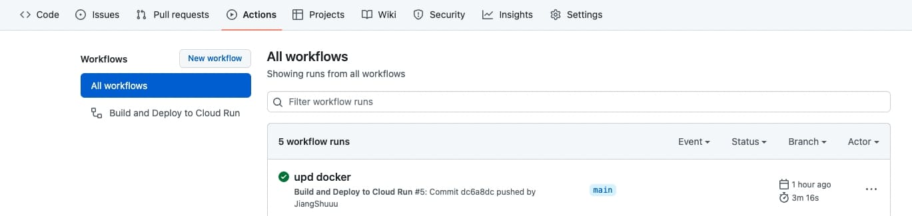

# 【實作】GithubAction 自動化部署

把雲端以及docker環境建立好之後, 接著要在專案設定 GithubAction,  

讓每次推上指定分支後, GithubAction 就能自動幫我們做好之後的整段部署。

## 前置作業

- 雲端主機, 有Docker [(可參考連結)](https://jiangshuuu.com/docs/Docker/docker-nginx-manager-portainer/)
- [DockerHub Access-Tokens 申請教學](https://docs.docker.com/docker-hub/access-tokens/)
- SSH_PRIVATE_KEY
- 環境變數設定 Github >> 專案 >> Settings >> Secrets >> Actions

### SSH_PRIVATE_KEY

要讓 GithubAction 透過 SSH 連到雲端主機, 

需要在雲端主機建立好 key 並且將公鑰加入到 authorized_keys 名單內, 簡單步驟記錄如下[(詳細點我)](https://github.com/appleboy/ssh-action)

- 生成 RSA 或 ed25519 的 key
- 將公鑰加入 authorized_keys 名單
- 根據版本可能要修改.ssh權限

## 前端專案 CD

接著在專案創建 yml 檔案後就能開始撰寫腳本，透過腳本要做到幾件事

- 執行專案內的Dockerfile
- Build 成 arm64 (因為雲端主機架構為arm64)
- push 上 dockerhub
- SSH 進主機, 刪除舊的 container 以及 image, 重新掛載新的

```bash title=資料夾路徑.github/workflows/main.yml
name: Build and Deploy to Cloud Run

on:
  push:
    branches:
    - main

jobs:   
  docker:
    runs-on: ubuntu-latest
    steps:
      - name: Checkout
        uses: actions/checkout@v3

      - name: Set up QEMU
        uses: docker/setup-qemu-action@v2

      - name: Set up Docker Buildx
        uses: docker/setup-buildx-action@v2

      - name: Login to DockerHub
        uses: docker/login-action@v2
        with:
          username: ${{ secrets.DOCKERHUB_USERNAME }}
          password: ${{ secrets.DOCKERHUB_TOKEN }}

      - name: Build and push
        uses: docker/build-push-action@v3
        with:
          context: .
          push: true
          platforms: linux/arm64
          build-args: |
            VITE_APIURL=${{ secrets.VITE_APIURL }}
            VITE_FIREBASE_API_KEY=${{ secrets.VITE_FIREBASE_API_KEY }}
            VITE_FIREBASE_AUTH_DOMAIN=${{ secrets.VITE_FIREBASE_AUTH_DOMAIN }}
            VITE_FIREBASE_PROJECT_ID=${{ secrets.VITE_FIREBASE_PROJECT_ID }}
            VITE_FIREBASE_STORAGE_BUCKET=${{ secrets.VITE_FIREBASE_STORAGE_BUCKET }}
            VITE_FIREBASE_MESSAGING_SENDER_ID=${{ secrets.VITE_FIREBASE_MESSAGING_SENDER_ID }}
            VITE_FIREBASE_APP_ID=${{ secrets.VITE_FIREBASE_APP_ID }}
          tags: ${{ secrets.DOCKERHUB_USERNAME }}/clothes:latest

      - name: Run Deploy
        uses: appleboy/ssh-action@master
        with:
          command_timeout: 4m
          host: ${{ secrets.HOST }}
          username: ${{ secrets.USERNAME }}
          key: ${{ secrets.SSH_PRIVATE_KEY }}
          script: |
            ${{secrets.DOCKER_SCRIPT}}
```

### 環境變數代表的意思

- DOCKERHUB_USERNAME： dockerhub的username
- DOCKERHUB_TOKEN：dockerhub申請的access-token
- HOST：雲端主機位置
- USERNAME：雲端主機username
- SSH_PRIVATE_KEY：剛剛申請好的ssh key
- DOCKER_SCRIPT：連進主機後操作docker腳本
    
    ```bash
    sudo docker stop [容器名稱] # 停止當前運行的container
    sudo docker container prune -f # 強制刪除未使用的container
    sudo docker image prune -a -f # 強制刪除未使用的image
    sudo docker run --name [容器名稱] -p [對外port]:[對內port] \
    --restart unless-stopped \
    -d [映像檔名稱:版本]
    ```
    

### docker/build-push-action

- platforms 建構映像檔架構
- build-args 環境變數
- tags 映像檔版本號

:::tip

由於 dockerfile 不吃 . 開頭的檔案, 所以在 build 的時候會抓不到 .env 的參數,  
這邊改用 build-args 來定義 dockerfile 的 ARG, 再用 ENV 去吃 ARG 的參數

:::

## 後端專案 CD

基本上跟前端專案的步驟差不多, 差別只在

1. 由於後端專案是直接執行 node 所以不需要用 ARG 去設定環境變數
2. Script 需要多一個跟 Docker 內的資料庫連結

```bash
name: Build and Deploy to Cloud Run

on:
  push:
    branches:
    - main

jobs:   
  docker:
    runs-on: ubuntu-latest
    steps:
      - name: Checkout
        uses: actions/checkout@v3

      - name: Set up QEMU
        uses: docker/setup-qemu-action@v2

      - name: Set up Docker Buildx
        uses: docker/setup-buildx-action@v2

      - name: Login to DockerHub
        uses: docker/login-action@v2
        with:
          username: ${{ secrets.DOCKERHUB_USERNAME }}
          password: ${{ secrets.DOCKERHUB_TOKEN }}

      - name: Build and push
        uses: docker/build-push-action@v3
        with:
          context: .
          push: true
          platforms: linux/arm64
          tags: ${{ secrets.DOCKERHUB_USERNAME }}/clothes_api:latest

      - name: Run Deploy
        uses: appleboy/ssh-action@master
        with:
          command_timeout: 4m
          host: ${{ secrets.HOST }}
          username: ${{ secrets.USERNAME }}
          key: ${{ secrets.SSH_PRIVATE_KEY }}
          script: |
            ${{secrets.DOCKER_SCRIPT}}
```

### DOCKER_SCRIPT

由於專案直接用 node 執行, 所以環境變數在 run 的階段設定就行

```bash
sudo docker stop [容器名稱]
sudo docker container prune -f
sudo docker image prune -a -f
sudo docker run --name [容器名稱] -p [對外port]:[對內port] \
-e JWT_SECRET= \
-e IMGUR_CLIENT_ID= \
-e NODE_ENV= \ 
--restart unless-stopped \
-d [映像檔名稱:版本]
sudo docker network connect [network名稱] [容器名稱]
```

## 非 Docker 環境 CD

若主機沒有 Docker，想要直接進雲端部署，透過腳本要做到幾件事

- 透過 node build 成靜態檔
- 複製到雲端主機
- 取代 nginx 舊的靜態檔位置

```bash
name: Build and Deploy to Cloud Run

on:
  push:
    branches:
    - main

jobs:
  build:
    runs-on: ubuntu-latest # 環境
    steps:
      - uses: actions/checkout@v3 # git clone 專案

      - name: Use Node.js Install & Run build # Node
        uses: actions/setup-node@v3
        with:
          node-version: 16.14.2
      - run: npm install
      - run: npm run build

      - uses: appleboy/scp-action@master # scp 複製檔案
        with:
          host: ${{ secrets.HOST }}
          username: ${{ secrets.USERNAME }}
          key: ${{ secrets.SSH_PRIVATE_KEY }}
          source: 'build'
          target: '~/'

      - name: Run Deploy
        uses: appleboy/ssh-action@master # ssh 進主機執行腳本
        with:
          command_timeout: 4m
          host: ${{ secrets.HOST }}
          username: ${{ secrets.USERNAME }}
          key: ${{ secrets.SSH_PRIVATE_KEY }}
          script: |
            sudo rm -rf /var/www/xxx/xxx # 刪除舊的
            sudo cp -R /home/ubuntu/build /var/www/xxx/xxx # 複製新的
```

## Github 介面檢查
這邊設定推上 main 分支就會觸發 GithubAction, 可以到這邊檢查執行結果


## platforms 的時間差異

不同的 platforms build的時間也會有落差, 以前端部署的例子來看
- 預設的amd64

- 範例中的arm64


時間差了將近4分鐘，稍微查了一下似乎是因為arm為簡易指令集導致。

### 優化 dockerfile

目前把 build 的步驟教給了 Dockerfile 做, 導致不同架構 build 非常久,  
並且由於是SPA專案, 需要預先裝的env, 變成需要先定義 build-args, 再讓 Dockerfile 吃 ARG, 相當繁瑣。  

所以這邊直接把 build 這個步驟在本機完成, push 上去後 GithubAction 只負責 deploy 到雲端即可。

<details>
  <summary>原本的Dockerfile</summary>
  <code>
      <title>Dockerfile</title>
      <br/>
      FROM node:16-alpine
      <br/>
      <br/>
      WORKDIR /app
      <br/>
      <br/>
      COPY package.json .
      <br/>
      <br/>
      RUN yarn install
      <br/>
      <br/>
      COPY . .
      <br/>
      <br/>
      ARG VITE_APIURL
      <br/>
      ARG VITE_FIREBASE_API_KEY
      <br/>
      ARG VITE_FIREBASE_AUTH_DOMAIN
      <br/>
      ARG VITE_FIREBASE_PROJECT_ID
      <br/>
      ARG VITE_FIREBASE_STORAGE_BUCKET
      <br/>
      ARG VITE_FIREBASE_MESSAGING_SENDER_ID
      <br/>
      ARG VITE_FIREBASE_APP_ID
      <br/>
      <br/>
      ENV VITE_APIURL $VITE_APIURL
      <br/>
      ENV VITE_FIREBASE_API_KEY $VITE_FIREBASE_API_KEY
      <br/>
      ENV VITE_FIREBASE_AUTH_DOMAIN $VITE_FIREBASE_AUTH_DOMAIN
      <br/>
      ENV VITE_FIREBASE_PROJECT_ID $VITE_FIREBASE_PROJECT_ID
      <br/>
      ENV VITE_FIREBASE_STORAGE_BUCKET $VITE_FIREBASE_STORAGE_BUCKET
      <br/>
      ENV VITE_FIREBASE_MESSAGING_SENDER_ID $VITE_FIREBASE_MESSAGING_SENDER_ID
      <br/>
      ENV VITE_FIREBASE_APP_ID $VITE_FIREBASE_APP_ID
      <br/>
      <br/>
      FROM nginx:alpine
      <br/>
      <br/>
      WORKDIR /usr/share/nginx/html
      <br/>
      <br/>
      COPY --from=0 /app/dist .
      <br/>
      <br/>
      COPY ./nginx/docker.conf /etc/nginx/nginx.conf
      <br/>
      <br/>
      ENTRYPOINT ["nginx", "-g", "daemon off;"]
    </code>
</details>

```bash title=修改後的Dockerfile
# nginx
FROM nginx:alpine

WORKDIR /usr/share/nginx/html

# 複製build好的dist到nginx html路徑
COPY ./dist .  

COPY ./nginx/docker.conf /etc/nginx/nginx.conf

ENTRYPOINT ["nginx", "-g", "daemon off;"]
```

### 部署步驟

修改好 Dockerfile 後, 接著

1. 移除 github/workflows/main.yml中 "- name: Build and push" 步驟
2. 本機 build 成靜態檔
3. 推上 git 執行 GithubAction 看結果


成功從將近6分鐘的耗時, 縮短到40秒左右！
