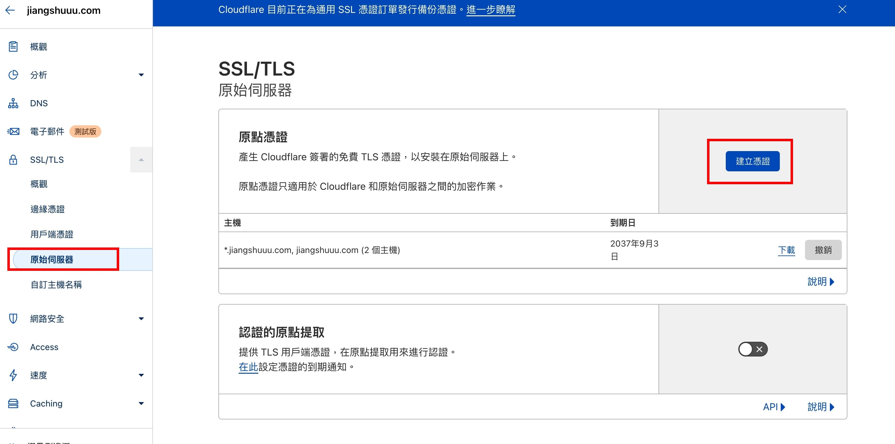

# 【實作】Cloudflare 申請網域及SSL憑證
在建立網站時，若沒有SSL標籤，除了瀏覽器會警告此網站不安全以外，對網站的SEO也有影響

但使用自簽的SSL，又需要每三個月再回去申請一次，非常不便。

做了一番功課後，發現在 Cloudflare 上購買網域，可以在他的平台直接申請SSL，並且會幫你自動續簽，非常方便

## 申請

直接上 cloudflare 申請 [https://www.cloudflare.com/zh-tw/](https://www.cloudflare.com/zh-tw/)

## 設定網域對應 IP 位置

- A Record (A紀錄)：是最常見的設定方式，就是把網址與 IP 做雙向的綁定，一綁一。
- CName Record (別名紀錄)：CNAME 指向的名稱最終還是會找到 A Record，CNAME 就像是一個網站可能有很多子網域。

範例把 [jiangshuuu.com](http://jiangshuuu.com) 用 A Record 指向 IP [1xx.xxx.xxx.xxx](http://1xx.xxx.xxx.xxx)，

接著用 CNAME 把test, www 兩個名稱綁在 jiangshuuu.com 上，

分別呈現 [test.jiangshuuu.com](http://test.jiangshuuu.com) 以及 www.jiangshuuu.com ，

這樣的好處除了多了兩個子網域以外，未來更換了IP位置，只要更改A Record的指向，其他兩個也會自動跟著變動。

## 申請 SSL

1. 進入SSL頁面 >> 點選建立憑證

2. 確認資訊 >> 點選建立

3. 將 cloudflare 提供的 Origin Certigicate 、 Pricate Key 存下來，放置你設定的 IP 主機上

大功告成！接著就能到設定的IP主機，用申請的 pem key 把網站變成 https

### 設定 IP https

參考步驟 **[【實作】專案部署至 Oracle Server](https://www.jiangshuuu.com/docs/CloudServer/oracle-nginx-upload-project/#443-https-設定)** 

## 參考文章

[https://www.digitalocean.com/community/tutorials/how-to-host-a-website-using-cloudflare-and-nginx-on-ubuntu-20-04#prerequisites](https://www.digitalocean.com/community/tutorials/how-to-host-a-website-using-cloudflare-and-nginx-on-ubuntu-20-04#prerequisites)