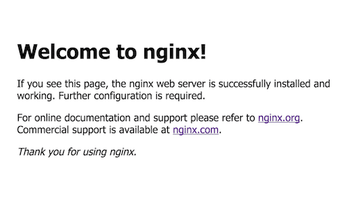
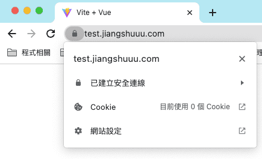

# 【實作】專案部署至 Oracle Server
`環境為：Oracle ubuntu22.04`

此篇紀錄如何將專案放置 Oracle 雲端, 並且設置 Nginx , 讓專案可以在網路上被搜到

## 前置作業

- Oracle 主機

若沒有 Oracle 帳號可以看這個影片跟著申請

[https://www.youtube.com/watch?v=5a5tdJh8mKY](https://www.youtube.com/watch?v=5a5tdJh8mKY)

- ssh 連進 Oracle 伺服器 ( 接下來的操作都在 Oracle 伺服器上 )

## Nginx 安裝＆設置

### 安裝 nginx

```jsx
sudo apt update
sudo apt install nginx
```

### Nginx 常用指令

```jsx
// 啟動 nginx
sudo systemctl start nginx
// 確認 nginx 狀態
sudo systemctl status nginx
// 停止 nginx
sudo systemctl stop nginx
// 重啟 nginx
sudo systemctl restart nginx
// 測試 nginx conf 檔
sudo nginx -t
```

### 確認 Nginx 服務正常運行

使用 sudo systemctl status nginx 確認 Nginx 狀態, 有顯示 Active: active (running) 即確認可以

```jsx
nginx.service - A high performance web server and a reverse proxy server
   Loaded: loaded (/lib/systemd/system/nginx.service; enabled; vendor preset: enabled)
   Active: active (running) since Fri 2022-09-09 02:49:43 UTC; 18min ago
 Main PID: 1461 (nginx)
   CGroup: /system.slice/nginx.service
           ├─1461 nginx: master process /usr/sbin/nginx -g daemon on; master_process on
           └─1463 nginx: worker process
```

## 防火牆設置

這步驟網路上有許多教學使用 ufw 防火牆, 但由於 oracle 有預設的 iptables, 所以這邊直接跟隨[官方文件](https://docs.oracle.com/zh-cn/solutions/connect-your-bot-to-ml-api/set-oracle-linux-instance1.html#GUID-7F675809-EABD-42F9-BA5F-2FEDCF019789)教學

~~（不然就會跟我一樣踩了許多坑）~~


### 打開防火牆, 允許 http 和 https 通信

```jsx
sudo firewall-cmd --permanent --zone=public --add-service=http 
sudo firewall-cmd --permanent --zone=public --add-service=https
sudo firewall-cmd --reload
```

這邊在輸入第一行時, 會顯示系統找不到 firewall

### 安裝 firewall

提示雖然顯示 install firewall, 但記得要加個 d, 不然找不到

```jsx
sudo apt-get install firewalld
```

### 回到官方教學

```jsx
sudo firewall-cmd --permanent --zone=public --add-service=http 
sudo firewall-cmd --permanent --zone=public --add-service=https
sudo firewall-cmd --reload
```

### Oracle 雲端設置端口

1. 進入 Oracle Cloud 控制台, 打開選單進入虛擬雲端網路
2. 點選預設的 VCN
3. 點選預設的子網路名稱
4. 點選預設的安全清單名稱
5. 點選新增傳入規則
6. 來源 CIDR 输入0.0.0.0/0， IP 協議選 TCP，目的地連接埠输入 80,443(或分開新增)
7. 點擊新增傳入規則，回到介面確認是否新增80, 443 兩個port

### 輸入 Oracle 該伺服器 IP 位置, 確認以下畫面
有出現 NGINX 預設畫面代表安裝成功


## 在伺服器上放上自己的專案

### 安裝 nvm 來安裝 node

```jsx
// 安裝 nvm
apt-get update
apt-get install build-essential libssl-dev
curl https://raw.githubusercontent.com/creationix/nvm/v0.25.0/install.sh | bash

// 重啟連線
source ~/.profile

// 確認 nvm
nvm --version

// 取得所有 node 版本
nvm ls-remote

// 安裝node
nvm install v16.14.0

// 使用安裝版本
nvm use v16.14.0

// 預設node 版本
nvm alias default v16.14.0
```

### 下載專案到伺服器上並且build好

1. git clone xxxx
2. cd xxxx
3. npm install
4. npm run build

### 將專案複製到 Nginx 指定路徑

從 nginx 預設的 conf 檔可以看到指定路徑為 /var/www

```jsx
sudo cp -R /home/ubuntu/xxxx/dist /var/www/webtest
```

### 新增 nginx conf

1. 進入 nginx conf 路徑

```jsx
cd /etc/nginx/sites-available
```

2. 建立 conf 檔

```jsx
sudo vim test.conf
```

```jsx
server {
	listen 80;
	listen [::]:80;

	server_name ORACLE_SEVER_IP;

	root /var/www/webtest;
	index index.html;

	location / {
		try_files $uri $uri/ /index.html;
	}
}
```

3. 建立軟連結

```jsx
sudo ln -s /etc/nginx/sites-available/test.conf /etc/nginx/sites-enabled/test.conf
```

4. 取消預設 nginx conf

```jsx
sudo unlink /etc/nginx/sites-enabled/default
```

### 測試並重啟 nginx

1. sudo nginx -t
2. sudo systemctl restart nginx

### 輸入 IP 確認畫面


有顯示專案即成功, 但目前瀏覽器會顯示不安全, 

這是因為目前主機並沒有 SSL , 可以自己申請免費SSL, 或者上網購買, 

## 443 https 設定

為了解決目前瀏覽器會顯示我們 IP 位置不安全, 所以需要在 Nginx conf 加上 443 SSL 認證

### 前置作業

- SSL簽證
- 網域

這邊推薦使用 cloudflare, 購買網域後可以再上面申請 ssl, cloudflare會自動幫你續簽, 申請方法可參考另一篇文章

點我**[【實作】Cloudflare 申請網域及SSL憑證](https://www.jiangshuuu.com/docs/CloudServer/cloudflare-apply-ssl)** 

### 更改 test.conf

回到 /etc/nginx/sites-available

```jsx
sudo vim test.conf
```

```jsx
server {
   listen 80;

   listen [::]:80;

   server_name test.jiangshuuu.com;

   return 302 https://$server_name$request_uri;
}

server {
    listen 443 ssl http2;

    listen [::]:443 ssl http2;

    server_name test.jiangshuuu.com;

    root  /var/www/webtest;

    index index.html;
   
    location / {
       try_files $uri $uri/ /index.html;
    }

   ## cloudflare 申請的 SSL 檔案位置
   ssl_certificate_key /etc/ssl/cloudflare/key.pem;
   ssl_certificate /etc/ssl/cloudflare/cert.pem;
}
```

### 測試並重啟 nginx

1. sudo nginx -t
2. sudo systemctl restart nginx

### 確認瀏覽器畫面
