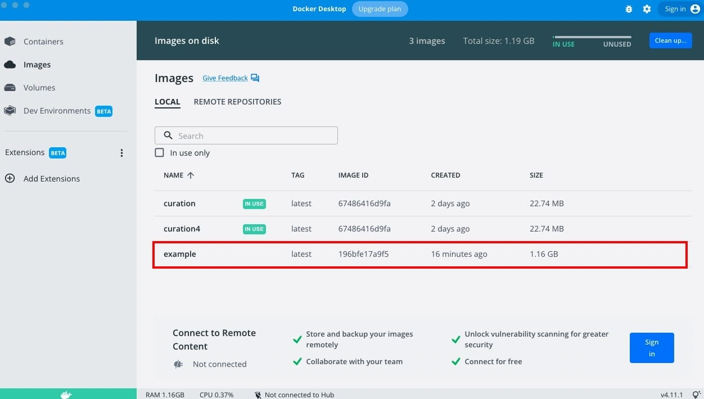
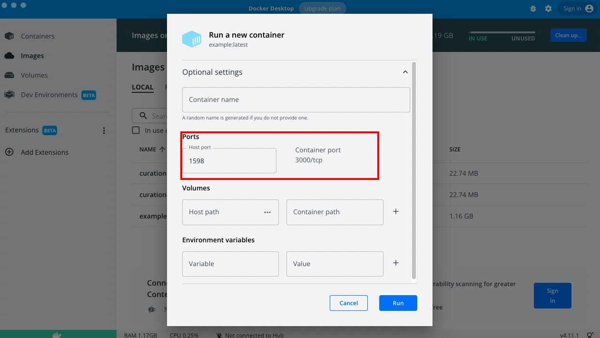
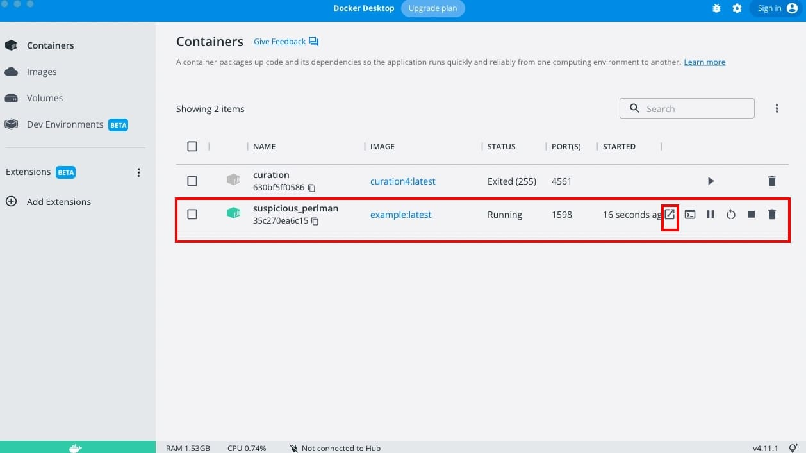
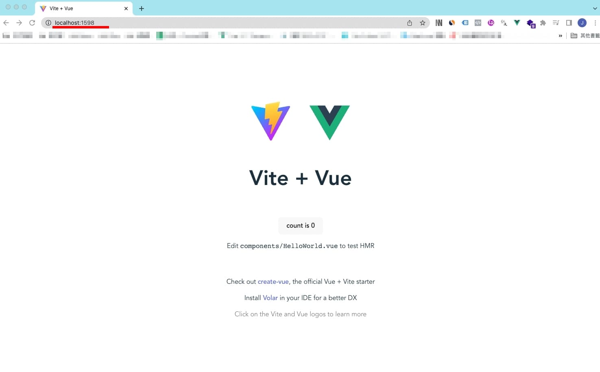
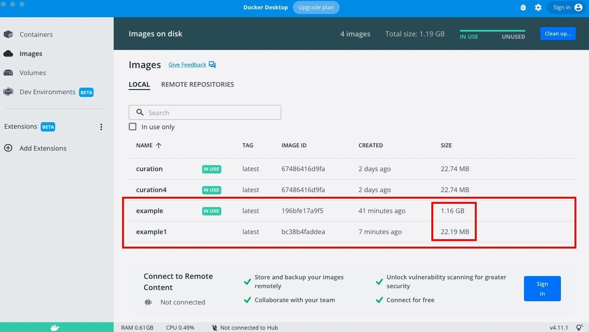
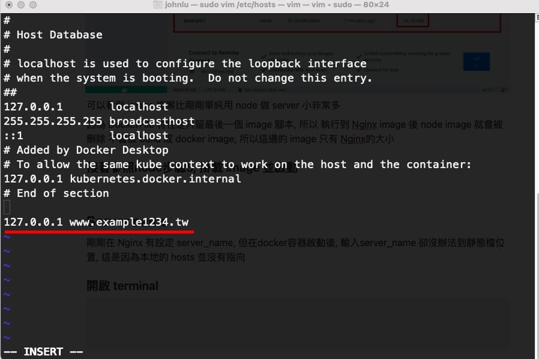

# 【實作】Docker 製作網頁 image
`環境為Mac`

## 前置作業

1. 本機安裝docker

[https://www.docker.com/get-started/](https://www.docker.com/get-started/)

先到docker官網安裝桌機程式, 並開啟

2. 準備一個 build 的起來的專案

## 使用 Node image 建立專案 image

### 1. 開啟專案, 在根目錄建立 Dockerfile

```jsx title="路徑 ./Dockerfile"
FROM node:lts

WORKDIR /app

COPY . .

RUN yarn install

EXPOSE 3000

CMD [ "yarn", "dev" ]
```

- FROM 指定docker hub 的image檔
- WORKDIR 指定路徑
- COPY 本地 DOCKER遠端
- RUN 指令
- EXPOSE 指定 post 位置
- CMD 執行指令
### 2. 建立 .dockerignore

```jsx title="路徑 ./.dockerignore"
dist
node_modules
```
作用如同 gitignore 防止 docker 吃到本地環境的 node_modules 跟 dist

:::caution

EXPOST 位置要跟 yarn dev 開啟時的位置一樣才能執行,
以vite舉例, 從 vite 3.0 開始, 官方預設 port為 4173

EXPOST 就要設成 4173 才能在 image 執行時 指向 4173 位置

也可以在 vite.config.js 設定 server 指回 3000

``` 範例
export default defineConfig({
  plugins: [vue()],
	
  // 加入這段
  server: {
    host: '0.0.0.0',
    port: 3000
  }
})
```
:::

### 3. 接著使用 docker 指令執行 DockerFile 腳本

```jsx
docker build -t example .
```

### 4. 在 docker 程式內掛載 example image

    
### 5. 設定 port, 位置隨意, 因為最後會導向 container port

    
### 6. 到 docker container 執行 example image

    
### 7. 畫面查看

    

使用 node 可以成功啟動我們的專案, 但可以看到 image 的檔案高達 1GB 以上, 因為 node server 需要整個 node_modules 才能執行

## 使用 docker + NGINX 建立 image

而在 server 運行這段, 可以使用 NGINX 來代替 node, 讓 node 只需要為我們把專案打包成靜態檔案即可

### 建立 NGINX conf

```jsx title="路徑 ./nginx/docker.conf"
worker_processes 4;

events { worker_connections 1024; }

http {
    server {
        listen 80;
        server_name www.example1234.tw;
        root  /usr/share/nginx/html;
        include /etc/nginx/mime.types;
        location / {
            try_files $uri /index.html;
        }
    }
}
```
- listen port位置
- server_name domain name
- root 檔案位置
- include 吃的檔案類型
- location 執行檔案名稱

### 建立 Dockerfile

```jsx title="路徑 ./Dockerfile"
# node
FROM node:lts

WORKDIR /app

COPY . .

RUN yarn install

RUN yarn build

# nginx
FROM nginx:alpine

WORKDIR /usr/share/nginx/html

COPY --from=0 /app/dist .

COPY ./nginx/docker.conf /etc/nginx/nginx.conf

ENTRYPOINT ["nginx", "-g", "daemon off;"]
```

- FROM 指定docker hub 的image檔
- WORKDIR 指定路徑
- COPY 本地 DOCKER遠端
- RUN 指令
- EXPOSE 指定 post 位置
- ENTRYPOINT 最後執行的指令

:::tip 白話
node 階段：先抓 node image, 在根目錄/app 將專案內的所有檔案 COPY 到 /app , 再來 yarn install 然後 build 成靜態檔

nginx 階段： 抓 nginx image, 指定目錄為 /usr/share/nginx/html, COPY 剛剛 build 好的所有檔案, 再 COPY 專案內的 nginx docker.conf 到 /etc/nginx 名稱為 nginx.conf
:::

:::tip —from=0 意思
```
/COPY --from=0 /app/dist .
```

由於Dockerfile內只會存在最後一個FROM Image, 所以使用/COPY --from=0 來複製 build 好的檔案到 .根目錄

—from=名稱  可以自訂, 0為預設, 名稱寫在第一個image的後面

```jsx title="Dockerfile"
# 這行
FROM node:lts AS builder  

WORKDIR /app

COPY . .

RUN yarn install

RUN yarn build

FROM nginx:alpine

WORKDIR /usr/share/nginx/html

# 這行
COPY --from=builder /app/dist . 

COPY ./nginx/docker.conf /etc/nginx/nginx.conf

ENTRYPOINT ["nginx", "-g", "daemon off;"]
```
:::
---

### 執行 Dockerfile 腳本

```jsx
docker build -t example1 .
```

### Docker 程式內掛載 example1 image



可以看到 image 檔案比剛剛單純用 node 做 server 小非常多

因為 Dockerfile 特性是只留最後一個 image 腳本, 所以執行到 Nginx image後 node image 就會被刪除,不會被 build成 docker image, 所以這邊的 image 只有 Nginx 的大小

### 接著參照node步驟5, 掛載 image 並啟動
參考剛剛 node 的 5 6 7步驟, 最後確認執行畫面

## Server name

剛剛在 Nginx 有設定 server_name, 但在docker容器啟動後, 輸入server_name 卻沒辦法到靜態檔位置, 這是因為本地的 hosts 並沒有指向

### 開啟 terminal

```jsx
sudo vim /etc/hosts
```



```JSX title="儲存指令"
:wq
```
### 瀏覽器看結果

輸入 www.example1234.tw:port

port 為剛剛在 docker 啟動image 設定的 port位置