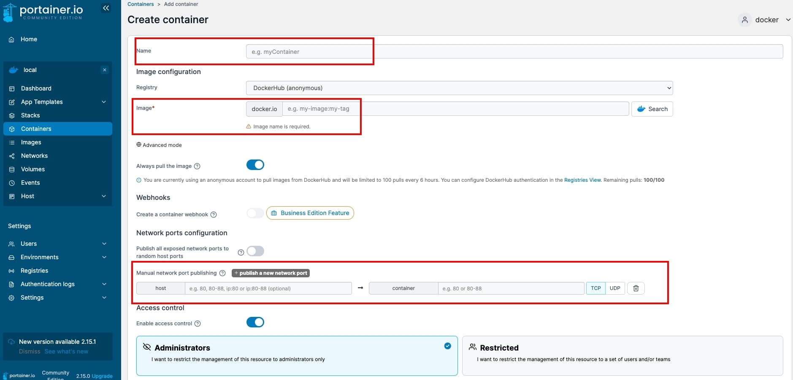
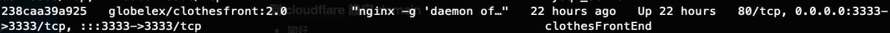
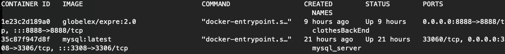
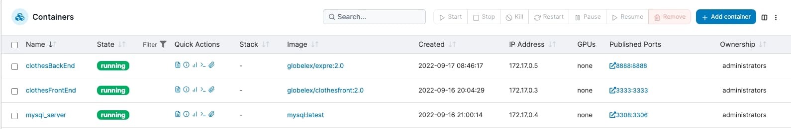

# 【實作】使用 Docker 部署前後端專案
`環境 Oracle + ubuntu 22.04`

在主機安裝好 Docker 以及必要工具後，接下來要把前後端專案透過 Docker 做雲端部署

以下為基礎的建立專案 image 以及丟上雲端的範例

## 前端專案

### 建立 Dockerfile

```jsx title="路徑 ./Dockerfile"
# node
FROM node:lts

WORKDIR /app

COPY . .

RUN yarn

RUN yarn build

# nginx
FROM nginx:alpine

WORKDIR /usr/share/nginx/html

COPY --from=0 /app/dist .

COPY ./nginx/docker.conf /etc/nginx/nginx.conf

ENTRYPOINT ["nginx", "-g", "daemon off;"]
```

### 建立 Nginx.conf

```jsx title="路徑 ./Nginx/docker.conf"
worker_processes 4;

events { worker_connections 1024; }

http {
    server {
        listen 3333;
        root  /usr/share/nginx/html;
        include /etc/nginx/mime.types;
        location / {
            try_files $uri /index.html;
        }
    }

```

以上檔案基本上都跟 **[【實作】Docker 製作網頁 image](https://www.jiangshuuu.com/docs/Docker/docker-create-image/#使用-docker--nginx-建立-image)** 的步驟相同, 唯一的差別在於 nginx.conf 的設定少了 server_name, 因為 server_name 會在 Nginx Proxy Manager 設定, 而這邊的 liseten 則為到時候的 port

簡言之，這邊的 Nginx 用處在於幫 docker 開好 Port

### build 成 image 檔案並上傳

1. 首先登入 dokcer hub

```
docker login
```

2. build 成 image

```
docker buildx build --platform linux/arm64 -t globelex/clothes:2.0 . --push
```

:::tip

這邊使用 buildx 是因為 Mac M1 build 出來的 image 檔案格式預設為 arm64/v8, 但在一般的主機上是使用 amd64 或者 arm64, 如果直接 build 的話, 該 image 會發生 docker run 時, 怎麼樣都沒辦法執行的狀況.  

所以這邊要特別注意雲端主機的晶片版本！

:::

### 把 image 掛到容器上執行

方法有兩種

1. ssh 進主機掛載剛剛上傳的image

```
docker run --name clothesFrontEnd -p 3333:3333 \
--restart unless-stopped \
-d globelex/clothes:2.0
```

2. 連進 portainer 使用介面建立容器
    


Portainer 簡介設定參考 **[【實作】在雲端上使用 Docker 做可視化管理](https://www.jiangshuuu.com/docs/Docker/docker-nginx-manager-portainer/#portainer)**

3. 確認容器是否執行 
- docker ps 確認


- painter 確認
  

### Nginx Proxy Manager 設定 proxy

Nginx Proxy Manager 簡介設定參考 **[【實作】在雲端上使用 Docker 做可視化管理](https://www.jiangshuuu.com/docs/Docker/docker-nginx-manager-portainer/#%E8%A8%AD%E5%AE%9A-host--port)**

1. Nginx Proxy Manager 建立 Proxy Hosts
2. Cloudflare 開好 domain name

### 測試

瀏覽器輸入剛剛設定的 domain name 就能開啟前端專案

ex. [https://profile.jiangshuuu.com/](https://profile.jiangshuuu.com/)

## 後端專案

### 進主機 run mysql

```bash
docker run --name mysql_server -p 3308:3306 \
-e MYSQL_ROOT_PASSWORD=password \
-e MYSQL_DATABASE=my_db \
-e MYSQL_USER=test \
-e MYSQL_PASSWORD=password \
--restart unless-stopped \
-d mysql:latest
```

- -e 後面為 mysql 的環境變數, 可自訂

### 確認專案的 config 檔案
確認專案中的 config 檔案, 資料庫設定參數跟上方 mysql_server 一樣
ex.
```jsx 
// ...
    ,
    "production": {
    "username": "test",
    "password": "password",
    "database": "my_db",
    "host": "mysql_server",
    "dialect": "mysql"
  },
// ...
``` 
### 建立 Dockerfile

```jsx title="路徑 ./Dockerfile"
FROM node:14-alpine

WORKDIR /app

COPY package.json .

RUN npm install

COPY . .

EXPOSE 8888

VOLUME [ "/app/node_modules" ]

CMD ["npm", "run", "dev"]
```

### build 成 image 檔案並上傳

1. 首先登入 dokcer hub

```
docker login
```

2. build 成 image

```
docker buildx build --platform linux/arm64 -t globelex/express:2.0 . --push
```

### 把 image 掛到容器上執行

1. ssh進主機執行

```bash
docker run --name clothesBackEnd -p 8888:8888 \
--restart unless-stopped \
-d globelex/express:2.0
```

2. 確認容器是否執行 
- docker ps  確認


- painter 確認
  

### docker network connect

此時後端專案還未跟剛剛建立的 mysql_server 連結, 以目前的狀態會無法新增種子資料以及模組, 所以需要用 docker network 來把兩個容器串在一起

1. 建立網路
sudo docker network create clothes
2. 連接網路
sudo docker network connect clothes 1e23c2d189a0 (後端專案的 container ID)
sudo docker network connect clothes 35c87f947d8f  (資料庫的 container ID)

### 建立模組及種子資料

1. 進到 docker 後端專案的容器內
sudo docker exec -ti 1e23c2d189a0 /bin/sh
2. npx sequelize db:migrate
npx sequelize db:seed:all

### Nginx Proxy Manager 設定 proxy

Nginx Proxy Manager 簡介設定參考 **[【實作】在雲端上使用 Docker 做可視化管理](https://www.jiangshuuu.com/docs/Docker/docker-nginx-manager-portainer/#%E8%A8%AD%E5%AE%9A-host--port)**

1. Nginx Proxy Manager 建立 Proxy Hosts
2. Cloudflare 開好 domain name

### 測試

瀏覽器輸入剛剛設定的 domain name 就能開啟後端專案

ex. [https://express.jiangshuuu.com/](https://express.jiangshuuu.com/)