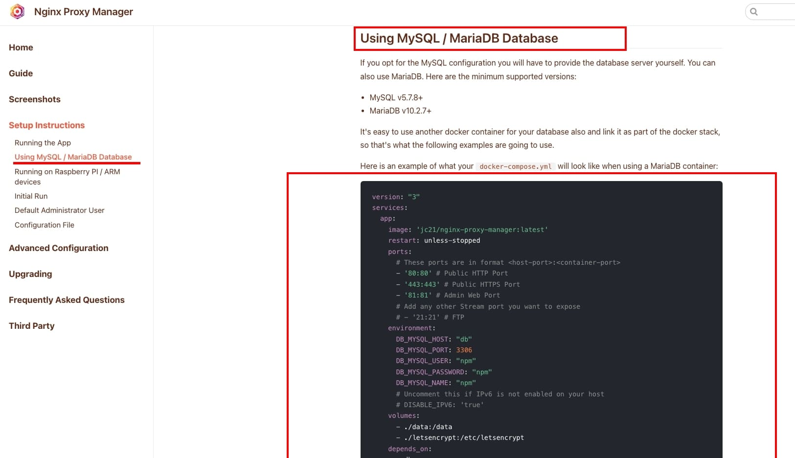
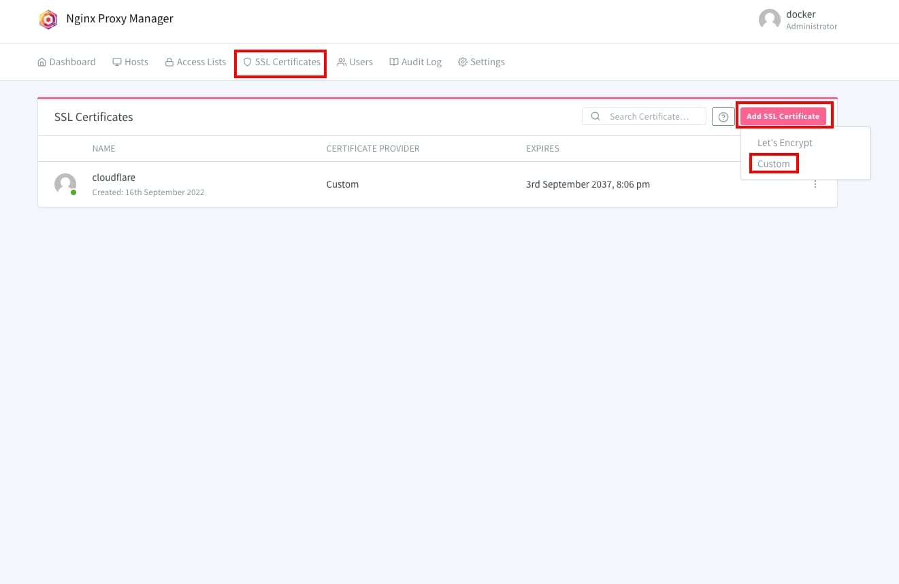
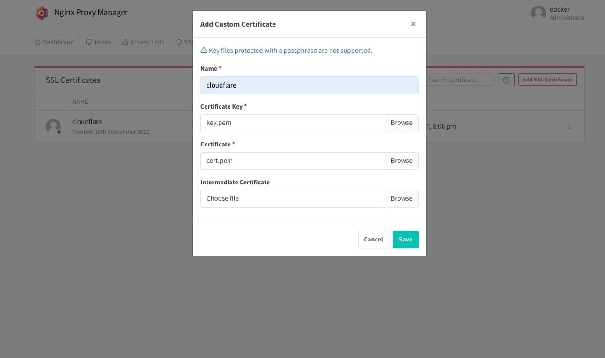
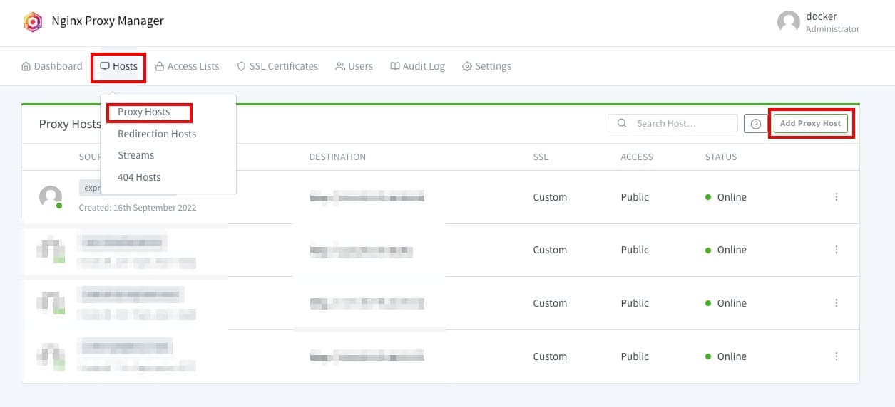
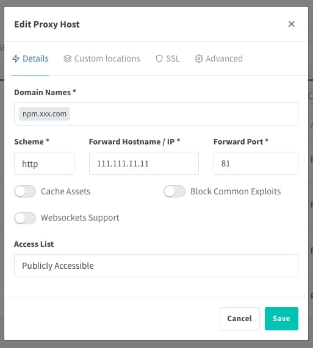
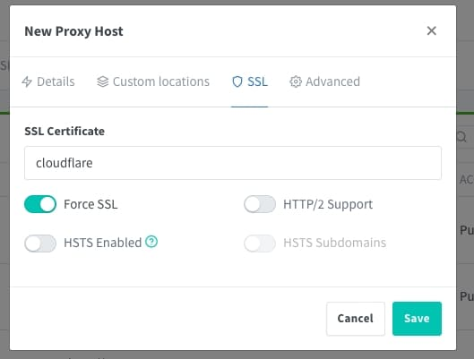
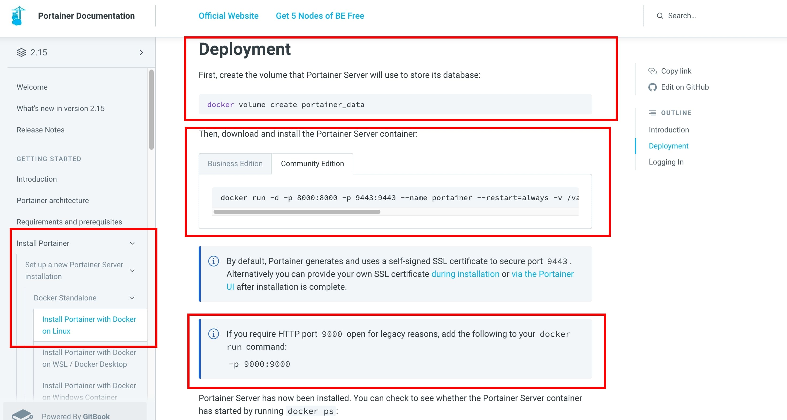
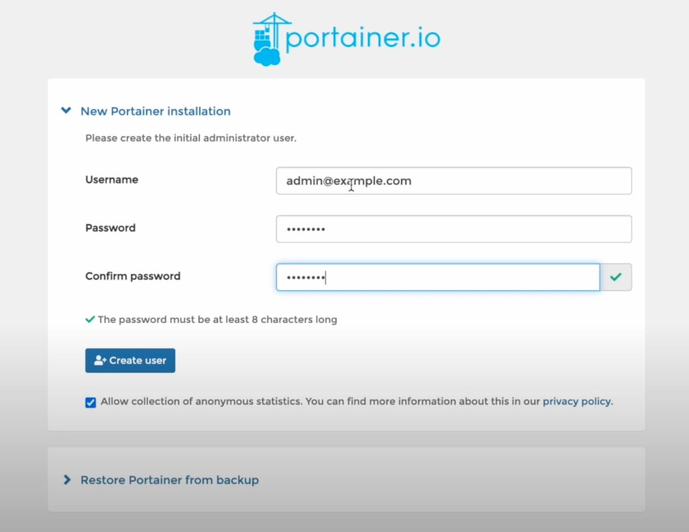
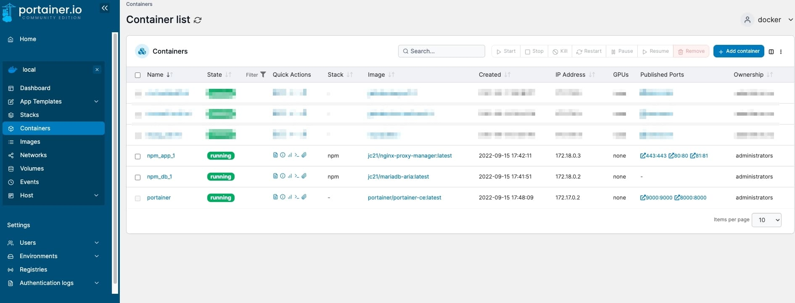

# 【實作】在雲端上使用 Docker 做可視化管理
`環境 Oracle + ubuntu 22.04`

在建立好雲端後，想把專案往雲上丟時，常常會遇到需要裝各種不同版本的 node 環境來做設定。

這時把專案全部包成 Docker image 使用 Docker 容器統一管理就不需要另外在雲端主機安裝 node 或是 python 等等執行專案需要的環境

不過此篇聚焦在雲端主機創好後需要的基礎建設, 專案的打包在之後介紹

## 前置作業
1. 乾淨的主機，需要 1G 以上的 RAM (不然裝一個專案就爆了)  
參考主機申請教學 **[【實作】專案部署至 Oracle Server](https://www.jiangshuuu.com/docs/CloudServer/oracle-nginx-upload-project/)**
2. 基礎 linux 指令知識, 能連進伺服器, 修改檔案
3. cloudflare SSL 簽證  
參考SSL申請教學 **[【實作】Cloudflare 申請網域及SSL憑證](https://www.jiangshuuu.com/docs/CloudServer/cloudflare-apply-ssl/)**

:::caution
接下來的操作都是使用 ssh 連進雲端主機操作, 請先確認是否能正常連線
:::

## 安裝 docker
- 連進雲端後, 執行以下步驟
```jsx
// 更新本地儲存庫
sudo apt update

// 安裝 Docker
sudo apt install docker.io
sudo apt install docker-compose

// 檢查 Docker 安裝是否成功
docker --version
輸出範例, Docker version 20.10.12, build 20.10.12-0ubuntu4

// 啟動 Docker
sudo systemctl start docker

//檢查 Docker 運行狀態
sudo systemctl status docker
輸出範例, 其中一行會寫 Active: active (running)

// 若需要停止 Docker 的指令
sudo systemctl enable docker
```

接著就能灌 Nginx Proxy Manager ＆ Portainer

## Nginx Proxy Manager

在 **[【實作】專案部署至 Oracle Server](https://www.jiangshuuu.com/docs/CloudServer/oracle-nginx-upload-project/)** 有提到如何使用 Nginx 把專案部署到雲端, 

但如果有多個專案時, 就需要設定多個 conf, 並且當網域更改或者 port 更改時, 就需要翻到指定的 conf 修改

而 Nginx Proxy Manager 就是使用圖像化的方式來管理每一個 Proxy 的反向代理, 做好 Nginx 的統一管理 

### 安裝

- 連進雲端後, 執行以下步驟

1. 複製 **[官方文檔](https://nginxproxymanager.com/setup/#using-mysql-mariadb-database)** 內的 docker-compose.yml



2. 建立檔案路徑 /home/ubuntu/docker/data/npm/docker-compose.yml 放在 docker/data 方便管理 docker 檔案
3. 執行 docker-compose up -d
4. 輸入主機ip: xxx.xxx.xxx.xxx:81 確認連線畫面  
(若沒辦法連進81 port, 請確認主機端的防火牆有沒有把 80、443、81 port打開)


5. 使用預設帳號密碼登入, 並修改自己使用的帳號密碼

```
Email:    admin@example.com
Password: changeme
```

### 上傳 SSL 簽證

沒有憑證的話可以參考 **[【實作】Cloudflare 申請網域及SSL憑證](https://www.jiangshuuu.com/docs/CloudServer/cloudflare-apply-ssl/)**

為了之後加入的網域都能有https, Nginx Proxy Manager, 提供了地方讓我們放申請的 ssl 簽證




上傳完 SSL 簽證後, 點選 Save 系統會先確認該簽證是否有效

### 設定 host & port

1. 回到 Host 新增 Proxy Host



2. 設定 Domain Names 等相關設定, 需要跟 Cloudflare DomainName一樣, port 為 docker images 設定的port (不知道 Domain Name 設定的話可以參考 **[【實作】Cloudflare 申請網域及SSL憑證](https://www.jiangshuuu.com/docs/CloudServer/cloudflare-apply-ssl/)**)
    


3. 在 SSL 欄位選擇剛剛設定好的 SSL 檔
    


4. 儲存後瀏覽器輸入剛剛設定的 [npm.xxx.com](http://npm.xxx.com) 即可看到帶有 https 的 Nginx Proxy Manager 登入頁

## Portainer

Portainer 為 Docker 的圖像化管理工具, 在上面可以直接創建容器, 下載映像檔, 選擇想使用的 templates, 設定 networks ….等 Docker 功能

### 安裝

1. 參考 [官方文件](https://docs.portainer.io/start/install/server/docker/linux) 安裝方法
    
 

 第一行是創建一個 portainer_data 資料夾, 並且有SSL認證的話指向 9443, 但由於我們 SSL 用 Nginx Proxy Manager 統一管理, 所以做一點小修改 Port 改為 9000, 並且把資料夾指向我們剛剛創建的 docker/data, 執行如下

```
docker run -d -p 8000:8000 -p 9000:9000 --name portainer --restart=always \
-v  /var/run/docker.sock:/var/run/docker.sock \ 
-v /home/ubuntu/docker/data/portainer/data:/data \
portainer/portainer-ce:latest
```

2. 輸入 docker ps 查看 portainer 是否正常運行

### 登入

1. 輸入主機ip: [xxx.xxx.xxx.xxx:9000](http://xxx.xxx.xxx.xxx:9000) 進入 portainer 頁面  
(若沒辦法連進9000 port, 請確認主機端的防火牆有沒有把 9000 port打開)


2. 建立管理員帳號後登入就能看到該主機目前運行docker的狀況了


### 加入 Nginx Proxy Manager

- Cloudflare 設定 domainName
- 參考 Nginx Proxy Manager 設定 host & port 步驟設定