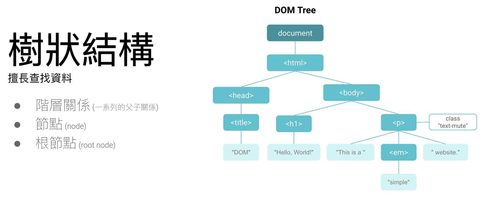
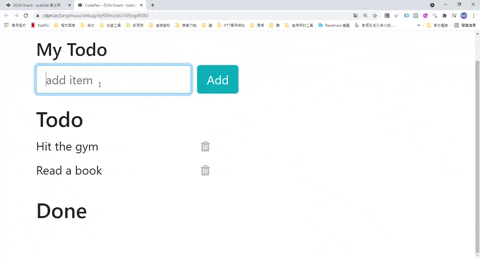

# DOM 基本操作

DOM 全名(Document Object Model)，為JS用來操作HTML物件的必備功能。

DOM 提供了文件（樹）的結構化表示法以及擁有屬性與函式的節點與物件組成的結構化表示。

節點也可以附加事件處理程序，一旦觸發事件就會執行處理程序。

本質上，它將網頁與程式語言連結在一起。

## 樹狀結構


### 程式碼範例

```html title="以上圖為例"
<html lang="en">
  <head>
    <meta charset="UTF-8" />
    <meta name="viewport" content="width=device-width, initial-scale=1.0" />
    <title>document</title>
  </head>

  <body>
    <h1>Hello, World</h1>
    <p>this is a <em>simple</em> website</p>
  </body>
</html>
```

因HTML讀取為由上至下，DOM tree會把所有的節點拆開，變成一個樹狀結構，方便用JavaScript修改DOM結構中的任一節點。

- HTML 被瀏覽器解析之後，變成一叫做 DOM 的結構
- JavaScript 可以修改 DOM 結構中任意節點
- 我們實際在視窗裡看到的結果，是 JavaScript 操作以後的結果

## 案例實作

假設我期望在輸入完後按下Add，能新增至Todo下。如：



```html title="HTML"
<div class="m-5">
  <header class="mb-3">
    <h4>My Todo</h4>
    <div class="form-inline">
      <input type="text" placeholder="add item" id="new-todo" class="form-control mr-2">
      <button id="add-btn" class="btn btn-info">Add</button>
      <div class="invalid-feedback">try again!</div>
    </div>
  </header>

  <h3>Todo</h3>
  <ul id="my-todo" class="list-unstyled">
    <!-- display todos here -->
  </ul>
  <h3>Done</h3>
  <ul id="done" class="list-unstyled">
    <!-- display todos here -->
  </ul>
</div>
```
```js title="JS操作DOM"
// 第一步，抓出HTML指定標籤的 id 或 class
const list = document.querySelector("#my-todo");
const addBtn = document.querySelector("#add-btn");
const input = document.querySelector("#new-todo");


// 第二步，定義todo裡的陣列
let todos = [
  "Hit the gym",
  "Read a book",
];

for (let todo of todos) {
  addItem(todo);
}

// 第三步，定義新增function
function addItem (text) {
  let newItem = document.createElement("li");
  newItem.innerHTML = `
    <label for="todo">${text}</label>
    <i class="delete fa fa-trash"></i>
  `;
  list.appendChild(newItem);
	input.value = ""
}

// 第四步，在指定標籤掛上 addEventListener(監聽器)
addBtn.addEventListener("click", addItem(inputValue));
// keypress可以操作鍵盤上的案件，來達成function
input.addEventListener("keypress", (event) => {
  if (event.key === "Enter") {
    addItem(inputValue);
  }
});
```

## 小結
DOM的操作在網頁非常的常見，舉凡輸入帳號密碼、PO文、追蹤、寄信、加入最愛...等功能，都是DOM操作。

而當HTML結構更為複雜時，則在操作DOM時需清楚的知道parent跟children的父子關係。