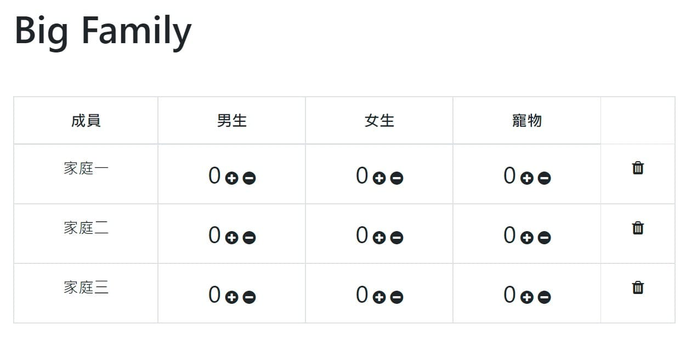
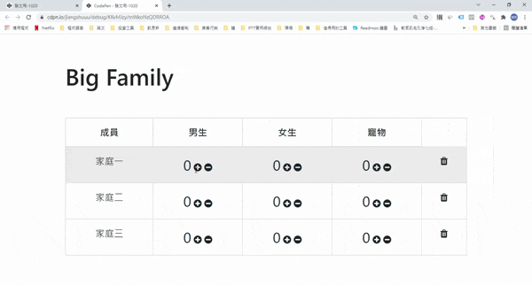
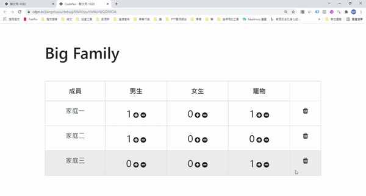

# DOM 父子關係

DOM的操作在網頁非常的常見，舉凡帳號密碼驗證、PO文、追蹤、寄信、加入最愛…等功能，都是DOM操作。

而當HTML結構更為複雜時，則在操作DOM時需清楚的知道parent跟children的父子關係。

## 實例

### 假設期望下圖能夠達成幾件事
1. 用一個陣列渲染表單畫面
2. 按增加減少扭，可以操作數字
3. 按垃圾桶可以刪除整行



```html title="HTML"
<div class="container">
  <h1 class="my-5">Big Family</h1>
  <table class="table table-bordered table-hover text-center">
    <thead>
      <tr>
        <th>成員</th>
        <th>男生</th>
        <th>女生</th>
        <th>寵物</th>
      </tr>
    </thead>
    <tbody id="data-panel">
      <!-- display data here -->
    </tbody>
  </table>
</div>
```
### 1.用一個陣列渲染表單畫面
```js title="JS"
// Step1 : 設定資料陣列
let players = [
  { name: "家庭一", pts: 0, reb: 0, ast: 0},
  { name: "家庭二", pts: 0, reb: 0, ast: 0},
  { name: "家庭三", pts: 0, reb: 0, ast: 0},
];

// Step2 : 指定要新增區域的class或id
const dataPanel = document.querySelector("#data-panel");

// Step3 : 定義渲染表格function
function displayPlayerList(dataList) {
  // 設定空字串
  let dataContent = "";
	
  // 將傳入Data用forEach遍歷所有資料
  dataList.forEach((dataList) => {
    dataContent += `<tr>`;
		
    // 如果傳入資料的key是name，則不增加+-符號
    for (let i in dataList) {
      if (i === "name") {
        dataContent += `<td>${dataList.name}</td>`;
      } else {
        dataContent += `
          <td><span style="font-size: 25px">${dataList[i]}</span>
            <i class="fa fa-plus-circle up" aria-hidden="true"></i>
            <i class="fa fa-minus-circle down" aria-hidden="true"></i>
          </td>`;
      }
    }
    dataContent += `<th><i class="delete fa fa-trash"></i></th>`
    dataContent += `<tr>`;
  });

  // 最後用innerHTML加入指定id區域(dataPanel)
  dataPanel.innerHTML = dataContent;
}

// 傳入指定資料
displayPlayerList(players);
```
#### 此時的HTML效果就會跟這個一樣
```html title="此時的HTML"
<div class="container">
  <h1 class="my-5">Big Family</h1>
  <table class="table table-bordered table-hover text-center">
    <thead>
      <tr>
        <th>成員</th>
        <th>家庭一</th>
        <th>家庭二</th>
        <th>家庭三</th>
        <th>家庭四</th>
      </tr>
    </thead>
    <tbody id="data-panel">
      <!-- display data here -->
      <tr>
        <td>男生</td>
        <td><span style="font-size: 25px">0</span>
          <i class="fa fa-plus-circle up" aria-hidden="true"></i>
          <i class="fa fa-minus-circle down" aria-hidden="true"></i>
        </td>
        <td><span style="font-size: 25px">0</span>
          <i class="fa fa-plus-circle up" aria-hidden="true"></i>
          <i class="fa fa-minus-circle down" aria-hidden="true"></i>
        </td>
        <td><span style="font-size: 25px">0</span>
          <i class="fa fa-plus-circle up" aria-hidden="true"></i>
          <i class="fa fa-minus-circle down" aria-hidden="true"></i>
        </td>
        <td><span style="font-size: 25px">0</span>
          <i class="fa fa-plus-circle up" aria-hidden="true"></i>
          <i class="fa fa-minus-circle down" aria-hidden="true"></i>
        </td>
      </tr> 
      
      <tr>
        <td>女生</td>
        <td><span style="font-size: 25px">0</span>
          <i class="fa fa-plus-circle up" aria-hidden="true"></i>
          <i class="fa fa-minus-circle down" aria-hidden="true"></i>
        </td>
        <td><span style="font-size: 25px">0</span>
          <i class="fa fa-plus-circle up" aria-hidden="true"></i>
          <i class="fa fa-minus-circle down" aria-hidden="true"></i>
        </td>
        <td><span style="font-size: 25px">0</span>
          <i class="fa fa-plus-circle up" aria-hidden="true"></i>
          <i class="fa fa-minus-circle down" aria-hidden="true"></i>
        </td>
        <td><span style="font-size: 25px">0</span>
          <i class="fa fa-plus-circle up" aria-hidden="true"></i>
          <i class="fa fa-minus-circle down" aria-hidden="true"></i>
        </td>
      </tr> 
      
      <tr>
        <td>寵物</td>
        <td><span style="font-size: 25px">0</span>
          <i class="fa fa-plus-circle up" aria-hidden="true"></i>
          <i class="fa fa-minus-circle down" aria-hidden="true"></i>
        </td>
        <td><span style="font-size: 25px">0</span>
          <i class="fa fa-plus-circle up" aria-hidden="true"></i>
          <i class="fa fa-minus-circle down" aria-hidden="true"></i>
        </td>
        <td><span style="font-size: 25px">0</span>
          <i class="fa fa-plus-circle up" aria-hidden="true"></i>
          <i class="fa fa-minus-circle down" aria-hidden="true"></i>
        </td>
        <td><span style="font-size: 25px">0</span>
          <i class="fa fa-plus-circle up" aria-hidden="true"></i>
          <i class="fa fa-minus-circle down" aria-hidden="true"></i>
        </td>
      </tr> 
    </tbody>
  </table>
</div>
```
### 2.按增加減少鈕，可以操作數字



```js title="JS"
// 在dataPanel掛上監聽器
dataPanel.addEventListener("click", (event) => {
  const target = event.target;

  // 點到 + - 符號才執行
  if (target.matches(".up") || target.matches(".down")) {
    
    // 選取 "分數" ，也就是加減符號的父元素裡的第一個子元素
    let scoreName = target.parentElement.firstElementChild;
    
    // 定義 "分數" 裡的 text ，也就是數字
    let score = +target.parentElement.firstElementChild.innerText;
    
    // 設定加減判斷
    if (target.matches(".up")) {
      score += 1;
    } else if (score <= 0) {
      score = 0; 
    } else {
      score -= 1;
    }
    
    //最後染畫面的分數
    scoreName.innerText = score;
  } 
});
```

### 3.按垃圾桶可以刪除整行

```js title="JS"
// 一樣在dataPanel裡加一個if判斷式，選取整個parent區塊
if (target.classList.contains('delete')) {
    target.parentElement.parentElement.remove()
  }
```

## 總結
在進行DOM操作的時候，很常搞不清楚現在在哪個位置，這時候可以在監聽器裡，善用console.log的功能看看目前的位置在哪。
