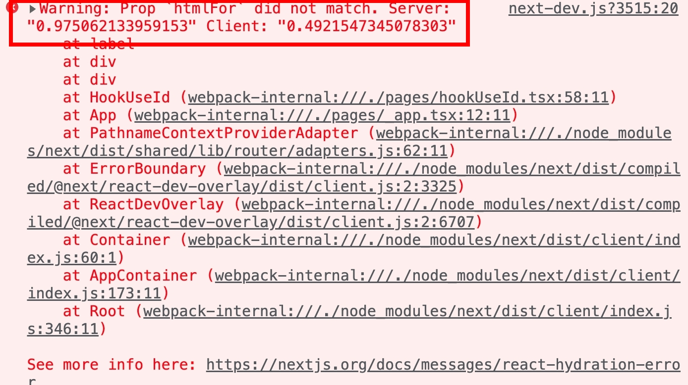

# ReactHooks(四)- useID, useTransition, useDeferrfedValue
## useId

### 定義

- 用於生成唯一ID, ex. :rm:
- useID 無法使用 getElementById 等方法操控

### 範例

```jsx

export default function Checkbox() {
	const id = Math.random();
  return （
		<>
      <label htmlFor={id}>Do you like React?</label>
      <input type="checkbox" name="react" id={id} />
    </>
	)
}
```

如果在 CSR 使用, 隨機產生的 id 會是穩定的, 組件不會報錯

但在 SSR 使用, 會因為兩次 id 不同而產生下列錯誤



基本上就是說 id 在 server 端為 “0.975….” 但在 client 端為 “0.492…”

而 useID 能解決這個問題, 用法也很簡單

```jsx
function Checkbox() {
  // 生成唯一id
  const id = useId();
  return (
    <>
      <label htmlFor={id}>Do you like React?</label>
      <input type="checkbox" name="react" id={id} />
    </>
  );
);
```

## useDeferrfedValue

### 定義

- 處理延遲獲取的值, 例如搜尋
- 用於無法控制的值, 例如子層props

### 範例

`const deferredValue = useDeferredValue(value);`

- 通常用於 input , 搜尋場景

使用者輸入到想要的結果通常不會是一個字, 而把這個行為放在 input 的 onChange 事件上會讓每次輸入都會觸發一次, 所以 input value 使用 useDeferrfedValue 包起來,  讓 react 知道 keep的這個值會有延遲, 讓使用者真的輸入完想要的值後, 才執行後續

傳統上會用 debounce 來解決這類的問題，但是跟 debouce 不一樣的是 useDeferredValue 是**被觸發後**才做回傳更新後的資料

```jsx
// Child
function Lists({ input }: { input: string }) {
  const LIST_SIZE = 10000;
  const defferedInput = useDeferredValue(input);

  // useMemo 用於每次畫面re-Render時, 若結果一樣則不再次 render
  const list = useMemo(() => {
    const product = [];
    for (let i = 0; i < LIST_SIZE; i++) {
      product.push(<div key={i}>{defferedInput}</div>);
    }
    return <>{product}</>;
  }, [defferedInput]);

  useEffect(() => {
    console.log(`Input: ${input}\n Deffered: ${defferedInput}`);
  }, [input, defferedInput]);

  return list;
}

// parent

export default function HookUseDefferedValue() {
  const [input, setInput] = useState('');

  const handleChange = (e: React.ChangeEvent<HTMLInputElement>) => {
    setInput(e.target.value);
  };

  return (
    <div className='content'>
      <h1>hookUseDefferedValue</h1>
      <header>
        <Link href='/'>Home</Link>
      </header>

      <div>
        <input type='text' value={input} onChange={handleChange} />
        <Lists input={input} />
      </div>
    </div>
  );
}
```

## useTransition

### 定義

- 處理一段邏輯, 處理過程狀態為 isPending
- 一般不建議使用, 因為會使 React 多產生一個狀態

### 範例

輸入後產生 20000 個陣列

```jsx
export default function HookUseTransition2() {
  const [isPending, startTransition] = useTransition();
  const [list, setList] = useState([] as string[]);
  const [input, setInput] = useState('');

  const LIST_SIZE = 20000;

  const handleChange = (e: React.ChangeEvent<HTMLInputElement>) => {
    setInput(e.target.value);
    startTransition(() => {
      if (input.length > 0) {
        const products = [] as string[];
        for (let i = 0; i < LIST_SIZE; i++) {
          products.push(input);
        }
        setList(products);
      }
    });
  };

  return (
    <div className='content'>
      <h1>useTransitionPush</h1>
      <header>
        <Link href='/'>Home</Link>
        <Link href='/hookUseTransitionFilter'>Filter</Link>
      </header>

      {/* input */}
      <div className='input'>
        <label htmlFor=''>輸入篩選數字</label>
        <input type='text' value={input} onChange={handleChange} />
      </div>

      {/* items */}
      <div>
        {isPending ? (
          'isLoading....'
        ) : (
          <>
            {list.map((item: string, idx: number) => {
              return (
                <div key={idx} className='item'>
                  <p>{item}</p>
                </div>
              );
            })}
          </>
        )}
      </div>
    </div>
  );
}
```