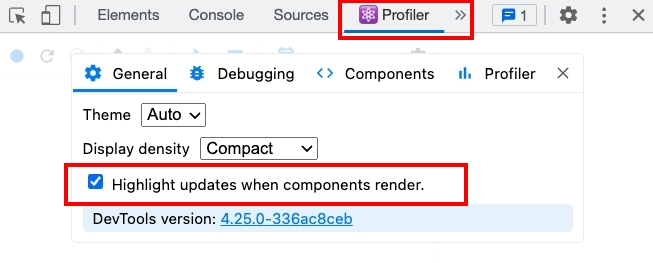
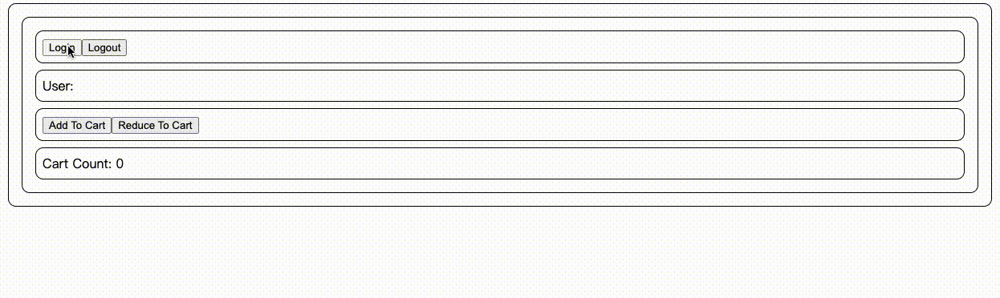
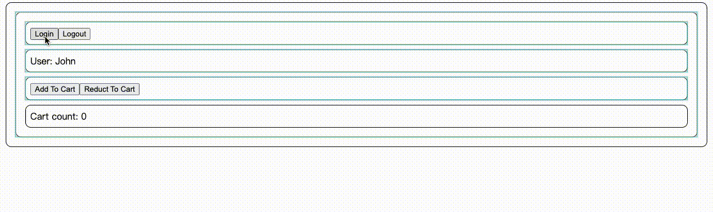
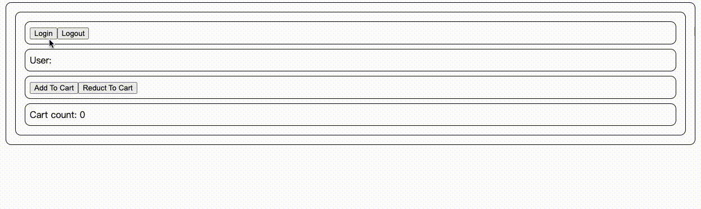
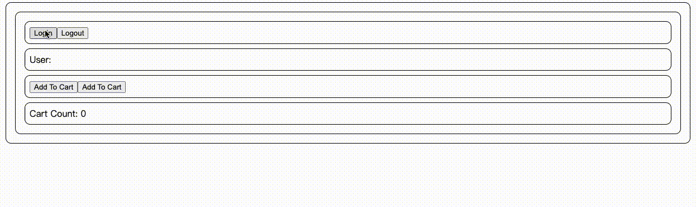

# ReactStateManager 狀態管理工具 
如果有個值經常會變化並且使用在不同頁面或者組件上, 就會需要 StateManager 來統一管理這些值的狀態, 例如登入狀態. 

而最常聽到的工具也就是 Redux, zustand, 或者原生的 useContext + useReducer (不建議)

以下就用這幾種來做比較

## 前置

- 瀏覽器裝上 Profiler 並開啟高亮 可以查看重新渲染的組件
  

- 範例功能包含
1. 登入登出
2. addCount & reduceCount

## useContext + useReducer

### 畫面示意



可以看到點選任一按鈕, 所有的組件都會重新渲染一次, 這是因為所有的組件都有用到 useContext

### Store

```jsx
// store/store-context.jsx
import { useState, createContext, useContext, useReducer } from "react"

const reducer = (state, action) => {
  switch (action.type) {
    case "add":
      return state + 1;
    case "reduce":
      return state - 1;
    default:
      return state;
  }
};

const useStore = () => {
  const [ user, setUser ] = useState('')
  const [ cartCount, dispatch ] = useReducer(reducer, 0)

  return {
    user,
    cartCount,
    login: () => setUser('John'),
    logout: () => setUser(''),
    addToCart: () => dispatch({type: 'add'}),
    reduceToCart: () => dispatch({type: 'reduce'})
  }
}

const StoreContext = createContext(null)

export const StoreContextProvider = ({ children }) => (
  <StoreContext.Provider value={useStore()}>
    { children }
  </StoreContext.Provider>
)

const useLogin = () => useContext(StoreContext).login;
const useLogout = () => useContext(StoreContext).logout;
const useAddToCart = () => useContext(StoreContext).addToCart;
const useReduceToCart = () => useContext(StoreContext).reduceToCart;
const useUser = () => useContext(StoreContext).user;
const useCartCount = () => useContext(StoreContext).cartCount;

export { useLogin, useLogout, useAddToCart, useUser, useCartCount, useReduceToCart }
```

### 引用頁面及組件

```jsx
// page/statemanager-context.jsx

import { useLogin, useReduceToCart, useAddToCart, useCartCount, useLogout, useUser, StoreContextProvider } from "../store/store-context"

// 子層
const LoginSection = () => {
  const login = useLogin()
  const logout = useLogout()
  return (
    <div>
      <button onClick={login}>Login</button>
      <button onClick={logout}>Logout</button>
    </div>
  )
}

// 子層
const UserSection = () => {
  const user = useUser()
  return (
    <div>User: {user}</div>
  )
}

// 子層
const AddToCartSection = () => {
  const addToCart = useAddToCart()
  const reduceToCart = useReduceToCart()
  return (
    <div>
      <button onClick={addToCart}>Add To Cart</button>
      <button onClick={reduceToCart}>Reduce To Cart</button>
    </div>
  );
};

// 子層
const CartCountSection = () => {
  const count = useCartCount()
  return (
    <div>Cart Count: {count}</div>
  )
}

// 父層
function ContextPage() {
  return (
    <div>
        <LoginSection />
        <UserSection />
        <AddToCartSection />
        <CartCountSection />
    </div>
  )
}

export default function ContextPageWrapper() {
  return (
    <StoreContextProvider>
      <ContextPage/>
    </StoreContextProvider>
  )
}
```

## useContextSelector

### 畫面示意



而為了解決 useContext會一直 reRender 的問題, 有網友就開發了 use-context-selector 這個套件來解決觸發的問題

不過可以發現即使用了 use-context-selector 觸發 function 機制時, 雖然 value 不會再被 reRender, 但是 function 的組件還是會被觸發, 

要解決這個問題就必須再加上 useCallback 去比較每次 reRender 時的 function 有沒有變更, 沒有的話就不會 reRender

- 加了 useCallback後



可以看到 function 組件不會再被重新觸發,

但即使這樣最外層的父層還是會一起被 reRender, 這是因為 useContext 本身機制是由父層向下傳遞, 所以無法避免

### Store

```jsx
// store/statemanager-context-selector.jsx
import { useState, useCallback, useReducer } from "react"
import { createContext, useContextSelector } from "use-context-selector"

const reducer = (state, action) => {
  switch (action.type) {
    case "add":
      return state + 1;
    case "reduce":
      return state - 1;
    default:
      return state;
  }
};

const useStore = () => {
  const [ user, setUser ] = useState('')
  const [ cartCount, dispatch ] = useReducer(reducer, 0)

  return {
    user,
    cartCount,
    login: useCallback(() => setUser('John'), []),
    logout: useCallback(() => setUser(''), []),
    addToCart: useCallback(() => dispatch({type: 'add'}), []),
    reduceToCart: useCallback(() => dispatch({type: 'reduce'}), [])
  }
}

const StoreContext = createContext(null)

export const StoreContextProvider = ({ children }) => (
  <StoreContext.Provider value={useStore()}>
    { children }
  </StoreContext.Provider>
)

const useLogin = () => useContextSelector(StoreContext, s => s.login);
const useLogout = () => useContextSelector(StoreContext, s => s.logout);
const useAddToCart = () => useContextSelector(StoreContext, s => s.addToCart);
const useReduceToCart = () => useContextSelector(StoreContext, s => s.reduceToCart)
const useUser = () => useContextSelector(StoreContext, s => s.user);
const useCartCount = () => useContextSelector(StoreContext, s => s.cartCount);

export { useLogin, useLogout, useAddToCart, useUser, useCartCount, useReduceToCart }
```

### 引用頁面及組件

```jsx
// page/statemanager-context-selector.jsx
import {
  useLogin,
  useLogout,
  useAddToCart,
  useUser,
  useCartCount,
  StoreContextProvider,
  useReduceToCart
} from "../store/store-context-selector";

// 子層
const LoginSection = () => {
  const login = useLogin();
  const logout = useLogout();

  return (
    <div>
      <button onClick={login}>Login</button>
      <button onClick={logout}>Logout</button>
    </div>
  );
};

// 子層
const UserSection = () => {
  const user = useUser();
  return <div>User: {user}</div>;
};

// 子層
const AddToCartSection = () => {
  const addToCart = useAddToCart();
  const reduceToCart = useReduceToCart()
  return (
    <div>
      <button onClick={addToCart}>Add To Cart</button>
      <button onClick={reduceToCart}>Reduct To Cart</button>
    </div>
  );
};

// 子層
const CartCountSection = () => {
  const cartCount = useCartCount();
  return <div>Cart count: {cartCount}</div>;
};

// 父層
function ContextPage() {
  return (
    <div>
      <LoginSection />
      <UserSection />
      <AddToCartSection />
      <CartCountSection />
    </div>
  );
}

export default function ContextPageWrapper() {
  return (
    <StoreContextProvider>
      <ContextPage />
    </StoreContextProvider>
  );
}
```

## Zustand

### 畫面示意



可以看到使用了 Zustand 這個專門的 StateManager, 各個區塊各司其職, 哪邊的值改變了就只 reRender 那個組件, 不會去影響到其他組件的狀態

### Store

```jsx
// store/store-zustand.js
import create from "zustand"

const useStore = create(set => ({
  user: "",
  cartCount: 0,
  login: () => set(() => ({
    user: "John"
  })),
  logout: () => set(() => ({
    user: ""
  })),
  addToCart: () => set(state => ({
    cartCount: state.cartCount + 1
  })),
  reduceToCart: () => set(state => ({
    cartCount: state.cartCount - 1
  }))
}))

const useLogin = () => useStore(state => state.login)
const useLogout = () => useStore(state => state.logout)
const useAddToCart = () => useStore(state => state.addToCart)
const useReduceToCart = () => useStore(state => state.reduceToCart)
const useUser = () => useStore(state => state.user)
const useCartCoint = () => useStore(state => state.cartCount)

export { useLogin, useLogout, useAddToCart, useUser, useCartCoint, useReduceToCart }
```

### 引用頁面及組件

```jsx
// page/statemanager-zustand.jsx
import { useLogin, useAddToCart, useCartCoint, useLogout, useUser, useReduceToCart } from "../store/store-zustand"

// 子層
const LoginSection = () => {
	const login = useLogin()
	const logout = useLogout()
  return (
    <div>
      <button onClick={login}>Login</button>
      <button onClick={logout}>Logout</button>
    </div>
  )
}

// 子層
const UserSection = () => {
  const user = useUser()
  return (
    <div>User: {user}</div>
  )
}

// 子層
const AddToCartSection = () => {
  const addToCart = useAddToCart()
  const reduceToCart = useReduceToCart()

  return (
    <div>
      <button onClick={addToCart}>Add To Cart</button>
      <button onClick={reduceToCart}>Add To Cart</button>
    </div>
  );
};

// 子層
const CartCountSection = () => {
  const count = useCartCoint()
  
  return (
    <div>Cart Count: {count}</div>
  )
}

// 父層
export default function ZustandPage() {
  return (
    <div>
      <LoginSection />
      <UserSection />
      <AddToCartSection />
      <CartCountSection />
    </div>
  )
}
```

## 總結

雖然用 useContext + useReducer 可以在使用原生 React 的情況下做到 StateManager, 但由於 useContext 的初衷是解決 props 多層向下傳遞, 所以真的要拿來做 StateManager 的話就必須顧慮到 state 改變造成組件的 reRender, state 可以用 useContextSelector來避免, function 可以用 useCallback 來避免

而使用 zustand 這類原本就爲了 StateManager 設計的第三方套件, 就不用擔心 reRender 問題, 因為他們的設計邏輯並不像 useContext是父層向下的多層傳遞

所以要做 StateManager 的話還是使用 zustand 這類的第三方套件最為省心