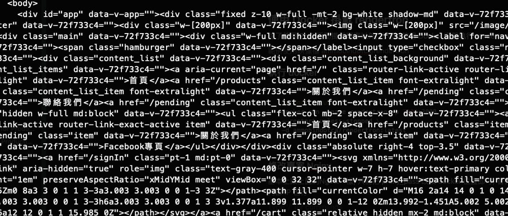
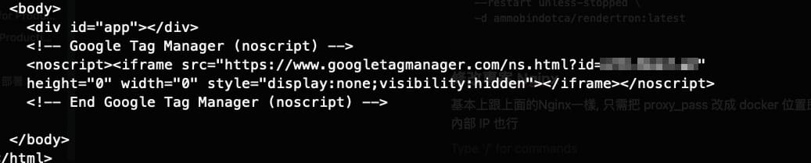

# 【實作】使用Rendertron讓SPA專案有SEO分數
當做好一個SPA(Single Page Application)網站後想增加SEO分數, 卻發現檢視網頁原始碼永遠只有空的 Html, 這是因為SPA是用 JavaScript 去生成網站架構, 但 bot 不一定會等你的 JavaScript 生成完才爬, 所以SPA網站往往SEO分數偏低

雖然 google 官方宣稱 google瀏覽器會等虛擬 DOM 執行完再讓SEO的爬蟲去爬網站架構, 但其他網站或程式並沒有特別說明支援 (ex. Line, Facebook, twitter … 等)

為了解決SEO問題, 許多人轉移到SSR專案(server side render), 來確保 bot 能抓到完整架構, 但那些 SPA 專案就沒辦法做 SEO 了嗎?

還好 Google Chrome 團隊開發了一個名叫 [rendertron 的專案, 並且在 GitHub上公開](https://github.com/GoogleChrome/rendertron), 用意就是解決瀏覽器爬蟲問題

## 實作流程

1. clone 到雲端主機上
2. Pm2 執行它
3. 專案的Nginx設定, 讓Nginx判別如果是bot則導向 rendertron 爬網頁架構

## 使用 PM2 掛載 rendertron

### 進入雲端主機, 下載並安裝

```bash
## clone 專案
git clone https://github.com/GoogleChrome/rendertron.git

## 進入資料夾
cd rendertron

## 安裝
npm install

## build
npm run build

## start, 看terminal有沒有輸出內容 Listening on port 3000, 或者curl戳一下看有沒有rendertron架構
npm run start
```

### Pm2掛載專案

確認可以執行後, 停掉程式改用Pm2 來執行

```bash
## 安裝 pm2
npm install pm2 -g

## pm2 啟動render專案
pm2 start build/rendertron.js

## pm2 列表確認
pm2 list

## pm2 其他指令
pm2 stop [name]
pm2 restart [name]
pm2 delete [name]
```

### 修改專案 Nginx

- location 設定 prender
- 檢查如果是 bot 則導到 rendertron 去爬網站架構, 一般使用者則給一般Html

[Nginx設定參考連結](https://gist.github.com/thoop/8165802)

以下範例假設架好的 rendertron 網域為 www.rendertron.com

```bash
server {
    ....
		......

    location / {
      try_files $uri @prerender;
    }
    
    location @prerender {
      set $prerender 0;

      if ($http_user_agent ~* "googlebot|bingbot|yandex|baiduspider|twitterbot|facebookexternalhit|rogerbot|linkedinbot|embedly|quora link preview|showyoubot|outbrain|pinterest\/0\.|pinterestbot|slackbot|vkShare|W3C_Validator|whatsapp") {
        set $prerender 1;
      }

      if ($args ~ "_escaped_fragment_") {
        set $prerender 1;
      }

      if ($uri ~* "\.(js|css|xml|less|png|jpg|jpeg|gif|pdf|doc|txt|ico|rss|zip|mp3|rar|exe|wmv|doc|avi|ppt|mpg|mpeg|tif|wav|mov|psd|ai|xls|mp4|m4a|swf|dat|dmg|iso|flv|m4v|torrent|ttf|woff|svg|eot)") {
        set $prerender 0;
      }

      #resolve using Google's DNS server to force DNS resolution and prevent caching of IPs
      resolver 8.8.8.8;

      if ($prerender = 1) {
        proxy_pass https://www.rendertron.com/render/$scheme://$host$request_uri;
      }

      if ($prerender = 0) {
        rewrite .* /index.html break;
      }
    }
  }
```

- $scheme 為 http / https
- $host 為 網域/主機位置
- $request_uri 為 網域/主機位置, “ / “後的內容(含” / “)

## 使用 Docker 掛載 rendertron

除了使用 Pm2 手動掛載專案以外, 也可以使用 Docker 開個 rendertron 容器

[範例使用映像檔 ammobindotca/rendertron](https://hub.docker.com/r/ammobindotca/rendertron/tags)

### 執行 docker

```bash
## docker run
docker run --name rendertron -p [對外port]:3000 \
--restart unless-stopped \
-d ammobindotca/rendertron:latest
```

### 修改專案 Nginx

基本上跟上面的Nginx一樣, 只需把 proxy_pass 改成 docker 位置即可, 看有沒有使用網域, 或者改用內部 IP 也行

## 測試

```bash
## bot
curl -A "googlebot" https://profile.jiangshuuu.com/

## 一般使用者
curl https://profile.jiangshuuu.com/
```

- bot
    


- 一般使用者
    
