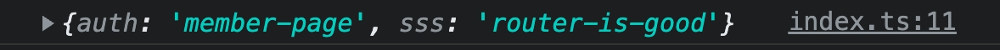

# 【套件】自動生成 vue-router 
`環境為 vite + vue3`

使用過Nuxt開發後, 就覺得 **Nuxt的Automatic Routes** 非常的方便, 

但由於目前公司傾向使用Vue3開發, 並且Nuxt3也還在RC階段, 所以只能重回基本的 vue-router 懷抱.

不過經過一番搜尋後, 發現了這兩個套件 「 [vite-plugin-vue-layouts](https://github.com/JohnCampionJr/vite-plugin-vue-layouts)、[vite-plugin-pages](https://github.com/hannoeru/vite-plugin-pages) 」, 他們能達成的效果跟 **Nuxt的Automatic Routes** 幾乎一樣的效果

接下來就來演示這神奇的套件

## 範例
-  https://github.com/hannoeru/vite-plugin-pages
-  https://github.com/JohnCampionJr/vite-plugin-vue-layouts

### 安裝/設定

```jsx
yarn add -D vite-plugin-pages
yarn add -D vite-plugin-vue-layouts
yarn add vue-router
```

- vite.config.ts 引入套件

```jsx
// vite.config.ts

import { defineConfig } from 'vite'
import vue from '@vitejs/plugin-vue'

// add
import Pages from 'vite-plugin-pages'
import Layouts from 'vite-plugin-vue-layouts'

// https://vitejs.dev/config/
export default defineConfig({
  plugins: [
    vue(),

    // https://github.com/hannoeru/vite-plugin-pages
    Pages(),

    // https://github.com/JohnCampionJr/vite-plugin-vue-layouts
    Layouts(),
  ]
})
```

- vue-router 引入套件設定

```jsx
// router/index.ts
import { createRouter, createWebHistory } from 'vue-router'
import { setupLayouts } from 'virtual:generated-layouts'
import generatedRoutes from 'virtual:generated-pages'

const router = createRouter({
  history: createWebHistory(),
  routes: setupLayouts(generatedRoutes)
})

export default router
```

- main.ts 引入 router

```jsx
// main.ts
import { createApp } from 'vue'
import './index.css'
import App from './App.vue'

// router
import router from './router'

createApp(App)
  .use(router)
  .mount('#app')
```

- tsconfig.json 引入套件規則

```jsx
// tsconfig.json
{
  "compilerOptions": {
    "target": "ESNext",
    "useDefineForClassFields": true,
    "module": "ESNext",
    "moduleResolution": "Node",
    "strict": true,
    "jsx": "preserve",
    "sourceMap": true,
    "resolveJsonModule": true,
    "isolatedModules": true,
    "esModuleInterop": true,
    "lib": ["ESNext", "DOM"],
    "skipLibCheck": true,
    "types": [
      "vite-plugin-pages/client",
      "vite-plugin-vue-layouts/client"
    ]
  },
  "include": ["src/**/*.ts", "src/**/*.d.ts", "src/**/*.tsx", "src/**/*.vue"],
  "references": [{ "path": "./tsconfig.node.json" }]
}
```

- App.vue 修改

```jsx
// App.vue
<template>
  <router-view />
</template>
```

### 資料夾結構

從官方說明知道, 可以定義多個資料夾名稱來定義Route

但這邊先**fouce在pages資料夾**裡

```jsx
src/
  ├── features/
  │  └── dashboard/
  │     ├── code/
  │     ├── components/
  │     └── pages/
  ├── admin/
  │   ├── code/
  │   ├── components/
  │   └── pages/
  └── pages/

// vite.config.js
export default {
  plugins: [
    Pages({
      dirs: [
        { dir: 'src/pages', baseRoute: '' },
        { dir: 'src/features/**/pages', baseRoute: 'features' },
        { dir: 'src/admin/pages', baseRoute: 'admin' },
      ],
    }),
  ],
}
```

### 404頁面

使用此套件, 404頁面只需要開個資料夾名稱為 […all] 並開個 index.vue 即可

```jsx
// src/pages/[...all]/index.vue

```

### id頁面

而id頁面有兩種方式使用

```jsx
1. src/pages/test-id-page/[id].vue
路由為 xxxx/test-id-page/:id

2. src/pages/items/index.vue  
路由為 xxxx/items

2-1. src/pages/items/[id]/index.vue
路由為 xxxx/items/:id

2-2. src/pages/items/[id]/news.vue
路由為 xxxx/items/:id/news
```

### router-view

當在特定頁面內想做router-view的切換時, 可以這樣做

```jsx
// src/pages/router-view-test.vue
// 路由為 xxxx/router-view-test

<template>
  <h1 class="text-2xl">router-view-test</h>
  <div class="my-4">
    <router-view></router-view>
  </div>
</template>
```

建立資料夾及頁面

```jsx
1. src/router-view-test/index.vue
路由為 xxxx/router-view-test

2. src/router-view-test/page2.vue
路由為 xxxx/router-view-test/page2

3. src/router-view-test/page3.vue
路由為 xxxx/router-view-test/page3
```

---

## 路由 layout

在最前面有安裝 layout 套件還沒使用到, 這個套件可以讓我們自訂每一個頁面的layout

### 預設 layout

預設為 src/layouts/default.vue, 設定好後即套用在所有頁面

```jsx
// src/layouts/default.vue
<script setup lang="ts">
import Menu from "../components/menu.vue"
</script>

<template>
  <main class="main">
		<Menu />
    <section class="w-full mx-auto max-w-[500px]">
      <h1 class="text-4xl mb-10 mt-5">Layout 1</h1>
      <router-view />
    </section>
  </main>
</template>
```

### 自訂 layout

假設自訂為 src/layouts/Layout2.vue, 並且想把他套用在404頁面

```jsx
// src/layouts/Layout2.vue

<template>
  <main class="main">
    <section class="w-full mx-auto max-w-[500px]">
      <h1 class="text-4xl mb-10 mt-5">Layout 2</h1>
      <router-view />
    </section>
  </main>
</template>
```

可以直接在404頁面內設定 yaml 檔, 來決定該頁使用的 layout

```jsx
// [...all].vue

<template>
  <main class="flex flex-col items-center space-y-3">
    <span class="text-2xl">
      404
    </span>
    <router-link class="text-xl border p-1" to="/">回首頁</router-link>
  </main>
</template>

<route lang="yaml">
meta:
  layout: Layout2
</route> 
```

### yaml 內的 meta

meta 除了用來做 layout 的切換以外, 也能自訂值來做其他應用(ex. 路由驗證)

```jsx
// member-only.vue

<template>
  <h1 class="text-2xl">
    會員頁
  </h1>
</template>

<route lang="yaml">
meta:
  layout: Layout2
	auth: member-page
	sss: router-is-good
</route> 
```

該 meta 的可以從 router.beforeEach 內的 to.meta 看到剛剛打的物件, 如



如此就能用這個值來達成會員頁以及訪客頁面的切換

## Deploy 部署

[https://vitejs.dev/guide/static-deploy.html#building-the-app](https://vitejs.dev/guide/static-deploy.html#building-the-app)

以git-page為例, 除了參考 vite 官方設定 base 位置以及sh檔案以外

需要額外到router檔案設定好位置, 才能正常執行,

若為 GCP 或 AWS 這類雲端空間則無需修改.

```jsx
// router/index.ts
import { createRouter, createWebHistory } from 'vue-router'
import { setupLayouts } from 'virtual:generated-layouts'
import generatedRoutes from 'virtual:generated-pages'

const router = createRouter({
  history: createWebHistory('vue3-test-website'),  // 修改這裏
  routes: setupLayouts(generatedRoutes)
})

router.beforeEach(async (to, from, next) => {
  console.log(to.meta)
  next()
})

export default router
```

### 部署範例
https://jiangshuuu.github.io/vue3-test-website/